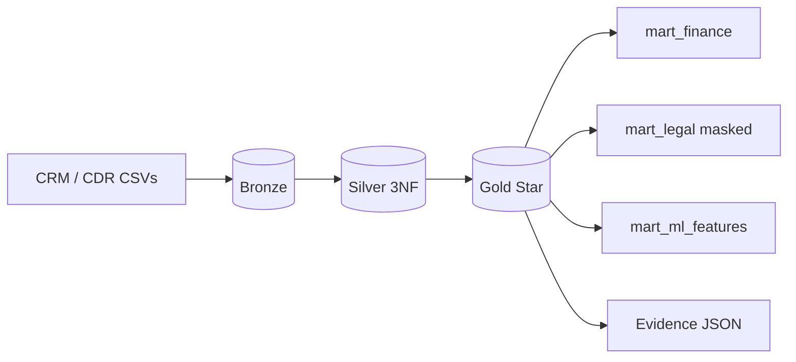

# Telco CRM Lakehouse (Databricks / GCP)

> **Compliance:** This is a **redacted portfolio design** of private production telco lakehouse work. Full-scale sharing of underlying private repos is **prohibited under compliance** — see [COMPLIANCE.md](COMPLIANCE.md). All data is synthetic.

Medallion lakehouse case study: ingest synthetic telco CRM and contact-center datasets, normalize to 3NF silver, publish star-schema gold, and deliver governed marts for **finance**, **legal**, and **ML** consumers. Local DuckDB emulator with **Databricks Unity Catalog + Airflow** production mapping.

Portfolio presentation style inspired by [Rao-Anas-Riaz](https://github.com/Rao-Anas-Riaz) — this repo is a more evolved DE/medallion implementation, not a copy.

| Doc | Purpose |
|---|---|
| [docs/diagrams/DATA-MODEL.md](docs/diagrams/DATA-MODEL.md) | **ERD diagrams** — source, gold star schema, marts (Uber-style data model) |
| [docs/DESIGN.md](docs/DESIGN.md) | Architecture, schemas, failure matrix, lineage |
| [docs/HANDOVER.md](docs/HANDOVER.md) | Run / verify / handover checklist |
| [docs/databricks/DATABRICKS-SERVICES.md](docs/databricks/DATABRICKS-SERVICES.md) | Databricks + orchestration mapping |
| [SOLUTION.md](SOLUTION.md) | Ask → code → expected output |
| [data/evidence/](data/evidence/) | Certified run metrics |

---

## Overview

1. **Ingestion** — Load CRM, CDR, offers, intent CSVs ([`generate_samples.py`](codebase/scripts/generate_samples.py)); production: **Airflow / DLT**
2. **Validation** — Pydantic contracts + DLQ ([`schemas/`](codebase/telco_lakehouse/schemas/), [`dlq.py`](codebase/telco_lakehouse/quality/dlq.py))
3. **Silver** — 3NF normalized entities ([`pipeline.py`](codebase/telco_lakehouse/orchestration/pipeline.py))
4. **Gold** — Star schema dimensions + facts (customer, agent, disposition, call, offer)
5. **Marts** — Finance revenue, legal compliance (masked), ML feature store
6. **CI/CD** — GitHub Actions lint + pytest + packaging ([`.github/workflows/ci.yml`](.github/workflows/ci.yml))

---

## Architecture



Docker layer scheduler: [`docker-compose.yml`](docker-compose.yml) · [`scheduler/run_layers.sh`](scheduler/run_layers.sh)

---

## Certified metrics (committed sample)

Artifact: [run_summary_index.json](data/evidence/run_summary_index.json)

| Metric | Result |
|---|---|
| Source → bronze | **4440 / 4440** |
| Gold fact calls | **1500** |
| Finance mart rows | **105** |
| Legal mart (masked) | **1500** |
| ML feature mart | **300** |
| Offer conversion | **33.38%** |
| Offer revenue | **$15,667.50** |
| DLQ | **0** |
| Tests | **6 / 6** pass |

Analytics SQL: [analytics_query.sql](analytics_query.sql)

---

## Getting started

```powershell
git clone https://github.com/imran-alik/telco-crm-lakehouse.git
cd telco-crm-lakehouse
py -3.12 -m pip install -r codebase\requirements.txt
$env:PYTHONPATH="codebase"
py -3.12 codebase\scripts\certify_public_run.py
py -3.12 -m pytest -q
```

Docker:

```powershell
docker compose up pipeline
docker compose up scheduler
```

Pass = certify exits **0**. Runbook: [codebase/scripts/HOW-TO-EXECUTE.md](codebase/scripts/HOW-TO-EXECUTE.md)

---

## Repository layout (medallion + packages)

```
medallion/
  bronze/python/          # CSV ingest (pipeline)
  silver/sql/             # 3NF entity SQL
  gold/sql/               # Star schema SQL
  marts/sql/              # Finance + ML mart SQL
packages/lakehouse_core/  # Freshness, health, guardrails, alerts
codebase/core/            # Re-exports for pipeline scripts
visualizations/           # Interactive HTML dashboard (Plotly CDN)
docker/docker-compose.onprem.yml
env/.env.example          # Protected credential placeholders
```

**Visualizations:** after certify, run `py -3.12 visualizations/build_dashboard.py` → [data/evidence/dashboard.html](data/evidence/dashboard.html)

**On-prem Docker:**

```powershell
copy env\.env.example env\.env
docker compose -f docker-compose.yml -f docker/docker-compose.onprem.yml up --build
```

---

## Dataset alignment

| Domain | Reference style | Sample file |
|---|---|---|
| CRM accounts | Siebel / Oracle party-account | `customers_crm.csv` |
| Contact center | Cisco UCCE CDR | `calls.csv` |
| ACD agents | Genesys / Genesis roster | `agents.csv` |
| Campaigns | Offer disposition | `offers_disposition.csv` |

Schema: [data-dictionary.md](data-dictionary.md)

---

## License

Portfolio case study. Synthetic samples only — no PII or production credentials.
