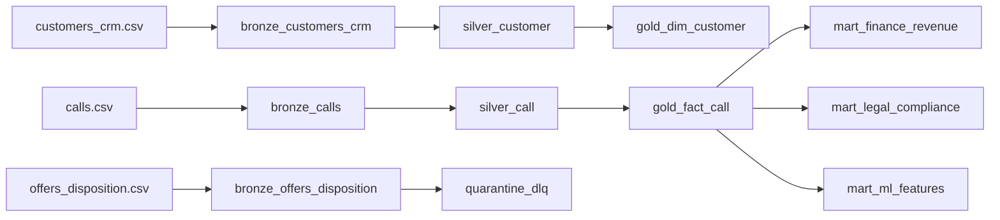

# DESIGN — Telco CRM Lakehouse

## Verdicts

| Area | Verdict | Evidence |
|---|---|---|
| Medallion bronze→gold | Pass | 4440 bronze rows, 2665 gold objects |
| Consumer marts (3) | Pass | finance 105, legal 1500 masked, ML 300 |
| Governance / masking | Pass | legal mart hashes ANI, masks email domain |
| Idempotent replay | Pass | certify quality gate |
| CI pipeline | Pass | ruff + pytest + certify |

## Problem statement

Telco operators combine CRM account data (Siebel/Oracle), contact-center CDRs (Cisco), and campaign outcomes. Analytics teams need a governed medallion with dimensional models and team-specific marts without exposing PII to legal/compliance consumers.

## Ask register

| ID | Ask | Module |
|---|---|---|
| **A1** | Ingest multi-source telco CSVs to bronze | `orchestration/pipeline.py` |
| **A2** | Validate schema + DLQ bad rows | `schemas/*`, `quality/dlq.py` |
| **A3** | Silver 3NF normalization | `run_silver()` |
| **A4** | Gold star schema (dims + facts) | `run_gold()` |
| **A5** | Finance revenue mart | `run_marts()` |
| **A6** | Legal mart with masking | `governance/masking.py` |
| **A7** | ML feature mart | `run_marts()` |
| **A8** | KPI + alerting | `analytics/kpi.py` |

## Sources and sinks

| Source | Grain | Bronze table | Rows |
|---|---|---|---|
| customers_crm.csv | customer | bronze_customers_crm | 300 |
| agents.csv | agent | bronze_agents | 40 |
| calls.csv | call | bronze_calls | 1500 |
| offers_disposition.csv | offer event | bronze_offers_disposition | 800 |
| intent_labels.csv | call intent | bronze_intent_labels | 1500 |
| demographics.csv | customer demo | bronze_demographics | 300 |

| Sink | Grain | Table |
|---|---|---|
| Silver 3NF | entity | silver_customer, silver_call, … |
| Gold star | dim/fact | gold_dim_*, gold_fact_* |
| Finance mart | date × segment × campaign | mart_finance_revenue |
| Legal mart | call (masked) | mart_legal_compliance |
| ML mart | customer features | mart_ml_features |

## Lineage

## Failure matrix

| Node | Failure | Behavior |
|---|---|---|
| Bronze ingest | Pydantic validation error | DLQ JSON, row skipped |
| Bronze ingest | Missing sample file | Pipeline raises FileNotFoundError |
| Silver join | Orphan demographics | LEFT JOIN preserves customer |
| Gold build | Empty bronze | Zero-row dims (degenerate) |
| Legal mart | Raw ANI present | `apply_legal_mask` hashes before insert |
| Scheduler layer | Non-zero exit | `run_layers.sh` stops chain |
| DuckDB lock (Windows) | File in use | KPI computed on open conn before close |

## Test plan

| Test | File | Asserts |
|---|---|---|
| Unit masking | test_pipeline.py | PII hash deterministic |
| Medallion E2E | test_pipeline.py | bronze→marts row counts |
| Idempotent replay | test_pipeline.py | stable bronze total |
| Gold schema | test_pipeline.py | 300 dims, 1500 facts |
| Certification | test_certification.py | certify exit 0 |

## Module map

| Path | Role |
|---|---|
| `codebase/telco_lakehouse/orchestration/pipeline.py` | Medallion orchestrator |
| `codebase/telco_lakehouse/governance/masking.py` | Legal masking policies |
| `codebase/telco_lakehouse/analytics/kpi.py` | KPI + alerts |
| `codebase/scripts/certify_public_run.py` | Evidence + quality gates |
| `scheduler/run_layers.sh` | Layer-wise Docker scheduler |
| `.github/workflows/ci.yml` | Lint, test, package |

## Document control

| Version | Date | Author | Change |
|---|---|---|---|
| 1.0 | 2026-09-14 | Portfolio | Initial medallion design |
