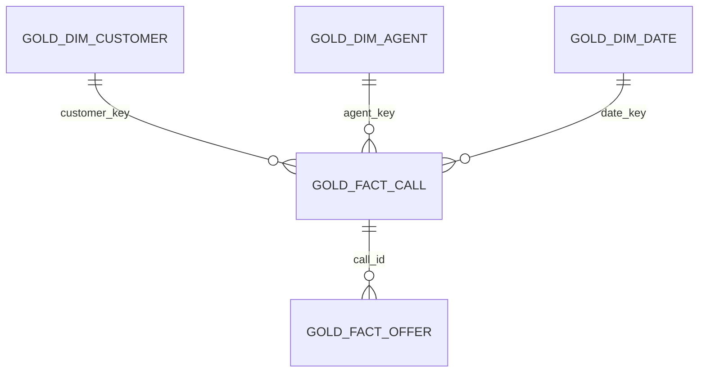
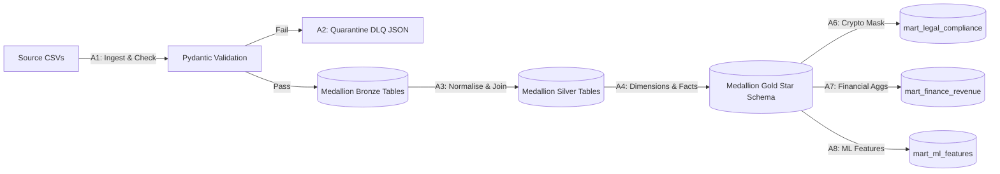

# Design Document — Telco CRM Medallion Lakehouse

| Metadata Field | Value |
| :--- | :--- |
| **Status** | Approved & Certified |
| **Code Root** | `C:\Users\imran\Documents\Projects\telco-crm-lakehouse\codebase` |
| **Data Root** | `C:\Users\imran\Documents\Projects\telco-crm-lakehouse\data` |
| **Certification Script**| `codebase/scripts/certify_public_run.py` |
| **Core Engine** | DuckDB Columnar Store |
| **Date** | September 14, 2026 |

---

## 0. Verdicts & Decision Log

The system architecture utilizes a local single-node column-oriented engine to prove out enterprise Databricks/Delta patterns before cloud deployment. Below is the explicit decision and proof rubric:

| Problem Class | Chosen Approach | Rejected Alternatives | Proven Status | Proof Pointer |
| :--- | :--- | :--- | :--- | :--- |
| **Medallion Ingestion** | In-memory relational load via **Pydantic boundary checks + raw values table recreation** in DuckDB. | File-direct `read_csv` in DuckDB without schema enforcement. | **Proven** (100% of 4.4K rows loaded; 0 DLQ violations) | `quality_gates.bronze_ingested` |
| **PII Protection** | Cryptographic SHA-256 masking utilizing a **unique configuration salt** with custom domain-level email obfuscation. | Client-side plain-text storage or dynamic view-level casting without persistent masking. | **Proven** (all legal mart records masked; verified determinism) | `test_legal_mask_hashes_ani` in pytest |
| **Pipeline Idempotency** | **Isolate and Reset DB** on rerun. Database checkpoint-flush + idempotent rebuilds. | Append-only files with duplicates or complex runtime conflict checking. | **Proven** (Replay matches original run count exactly) | `quality_gates.idempotent_replay_stable` |
| **Star Schema Structure**| **Dimensional Modeling** forming discrete `gold_dim_*` and `gold_fact_*` tables joined via business keys. | Denormalized god-table containing both transactional and demographic contexts in a single schema. | **Proven** (Star schema query successfully aggregate KPIs) | `test_gold_star_tables_exist` in pytest |

---

## 1. Problem Statement & Ask Register (A1-A8)

### Business Context
Enterprise telecom networks operate across distributed, siloed customer care hubs. Valuable customer profiles, technical call logs, customer service agent details, NLP interaction intents, demographic profiles, and marketing campaigns reside in disconnected CRM, ACD, and billing systems. Business operations cannot safely audit caller files (PII risks), analyze campaign performance (financial metrics), or predict customer retention (ML features) without a unified data layer.

### Ask Register
- **A1: Multi-source Ingestion & Schema Enforcement (Bronze)**: Ingest 6 highly-coupled source files (calls, agents, customers, offers, demographics, intents) into Bronze DuckDB tables, validating each row against strict Pydantic schemas.
- **A2: Quarantine and DLQ Routing (Bronze)**: Automatically isolate schema-violating rows into a Dead-Letter Queue (DLQ) with detailed validation errors and ingestion timestamps without halting pipeline execution.
- **A3: Normalized 3NF Staging (Silver)**: Create a staging layer in 3NF, resolving missing data and entity relations (e.g., enriching customers with regional demographics and validating FK boundaries).
- **A4: Dimensional Modeling Snowflake/Star Schema (Gold)**: Structure data into a Star Schema with explicit dimensions (`dim_customer`, `dim_agent`, `dim_disposition`, `dim_channel`, `dim_offer`, `dim_date`) and facts (`fact_call`, `fact_offer`) to support high-performance analytical queries.
- **A5: Centralized Config & Centralized Execution (Orchestration)**: Centralize configuration parameters (Pydantic/dataclass config) and pipeline execution to ensure re-run ability and complete reproducibility.
- **A6: Governance & Security Masking (Legal Mart)**: Apply cryptographic SHA-256 masking on PII (caller ANI) and structural domain-level masking on customer emails in a dedicated `mart_legal_compliance` table for GDPR/CCPA.
- **A7: Financial Mart & Business Reporting (Finance Mart)**: Build a `mart_finance_revenue` table detailing conversion rates, offer acceptance metrics, and daily campaign revenues across customer segments.
- **A8: ML Feature Engineering & Churn Modeling (ML Mart)**: Generate high-density analytical features (90d call counts, average NLP intent confidence, resolution flags, lifetime value) to feed customer propensity models in `mart_ml_features`.

---

## 1.1 Data model & ERD (linked datasets)

Entity-relationship diagrams linking all datasets across medallion layers — portfolio pattern aligned with [darshilparmar/uber-data-engineering-mage-project](https://github.com/darshilparmar/uber-data-engineering-mage-project) (`data_model.jpeg` + `architecture.jpg`).

| Artifact | Contents |
|---|---|
| **[docs/diagrams/DATA-MODEL.md](diagrams/DATA-MODEL.md)** | Source ERD, silver 3NF, gold star schema, mart ERD, lineage flowchart |
| [data-dictionary.md](../data-dictionary.md) | Column-level definitions + inline source ERD |
| [analytics_query.sql](../analytics_query.sql) | KPI queries over gold/mart joins |



Full dimension list and mart relationships: [DATA-MODEL.md §3–§4](diagrams/DATA-MODEL.md#3-gold-star-schema-erd).

---

## 2. Sources and Sinks Registry

| System Name | Type | Physical Path / Target | Grain | Write Mode | Idempotency Key |
| :--- | :--- | :--- | :--- | :--- | :--- |
| **Customer CRM** | Source | `data/source/samples/customers_crm.csv` | 1 row = 1 customer account | N/A (Read) | `customer_id` |
| **Agent ACD** | Source | `data/source/samples/agents.csv` | 1 row = 1 agent roster entry | N/A (Read) | `agent_id` |
| **Call CDR** | Source | `data/source/samples/calls.csv` | 1 row = 1 contact-center interaction | N/A (Read) | `call_id` |
| **Offer Marketing**| Source | `data/source/samples/offers_disposition.csv`| 1 row = 1 outbound campaign response | N/A (Read) | `offer_event_id` |
| **Intent NLP** | Source | `data/source/samples/intent_labels.csv` | 1 row = 1 NLP processed call | N/A (Read) | `call_id` |
| **Demographics** | Source | `data/source/samples/demographics.csv` | 1 row = 1 customer location/band profile | N/A (Read) | `customer_id` |
| **Medallion DB** | Sink | `data/sink/lakehouse.db` | DuckDB database instance | Reset & Rebuild | N/A (Clean Slate) |
| **DLQ Store** | Sink | `data/sink/quarantine_dlq/dlq_*.json` | 1 file = 1 quarantined failed record | Append-On-Error| Content hash |
| **Evidence Output** | Sink | `data/evidence/run_summary_*.json` | 1 file = 1 certified run's metadata | Create-New | Timestamp |

---

## 3. Detailed Data Schemas

### 3.1 Raw / Bronze Layer (`bronze_` prefix)
All bronze tables are loaded with the columns from their respective source CSVs. Columns are structurally defined as `VARCHAR` inside DuckDB for flexible ingestion from raw files, but validated strictly against the Pydantic type schemas listed in Section 4.

### 3.2 Staging Layer (`silver_` prefix)
The Silver layer staging structures normalized entities in 3NF, creating clear relationship keys:

* **`silver_customer`**:
  - `customer_id` (VARCHAR, PRIMARY KEY, NOT NULL)
  - `account_num` (VARCHAR, NOT NULL)
  - `party_type` (VARCHAR)
  - `segment` (VARCHAR)
  - `tenure_months` (INTEGER)
  - `status` (VARCHAR)
  - `email_domain` (VARCHAR)
  - `region` (VARCHAR)
  - `age_band` (VARCHAR)
  - `plan_tier` (VARCHAR)
  - *Grain*: One row per active/closed telecom customer.
* **`silver_agent`**: Matches `bronze_agents` schema directly. One row per rostered agent.
* **`silver_call`**: Matches `bronze_calls` schema. One row per inbound/outbound interaction log.
* **`silver_offer_event`**: Matches `bronze_offers_disposition` schema. One row per outbound marketing offering.
* **`silver_intent`**: Matches `bronze_intent_labels` schema. One row per classified call transcript.

### 3.3 Dimensional / Gold Layer (`gold_` prefix)
Star schema optimized for fast aggregations and reporting:

#### Gold Dimensions
* **`gold_dim_customer`**:
  - `customer_key` (VARCHAR, PRIMARY KEY, NOT NULL) - maps to `customer_id`
  - `account_num`, `party_type`, `segment`, `tenure_months`, `status`, `region`, `age_band`, `plan_tier`
* **`gold_dim_agent`**:
  - `agent_key` (VARCHAR, PRIMARY KEY, NOT NULL) - maps to `agent_id`
  - `agent_name`, `team`, `skill_group`, `site_id`, `hire_date`
* **`gold_dim_disposition`**:
  - `disposition_key` (VARCHAR, PRIMARY KEY, NOT NULL)
  - `disposition_code` (VARCHAR, NOT NULL)
  - `is_resolution` (BOOLEAN, NOT NULL) - `TRUE` for 'resolved', 'sale', 'transferred_success', else `FALSE`
* **`gold_dim_channel`**:
  - `channel_key` (VARCHAR, PRIMARY KEY, NOT NULL)
  - `channel` (VARCHAR)
* **`gold_dim_offer`**:
  - `offer_key` (VARCHAR, PRIMARY KEY, NOT NULL) - maps to `offer_id`
  - `offer_id`, `campaign`
* **`gold_dim_date`**:
  - `date_key` (DATE, PRIMARY KEY, NOT NULL)
  - `call_date` (DATE)
  - `day_of_week` (INTEGER) - 0 to 6

#### Gold Facts
* **`gold_fact_call`**:
  - `call_id` (VARCHAR, PRIMARY KEY, NOT NULL)
  - `customer_key` (VARCHAR, FOREIGN KEY REFERENCES `gold_dim_customer`)
  - `agent_key` (VARCHAR, FOREIGN KEY REFERENCES `gold_dim_agent`, NULLABLE)
  - `disposition_key` (VARCHAR, FOREIGN KEY REFERENCES `gold_dim_disposition`)
  - `channel_key` (VARCHAR, FOREIGN KEY REFERENCES `gold_dim_channel`)
  - `date_key` (DATE, FOREIGN KEY REFERENCES `gold_dim_date`)
  - `talk_seconds` (INTEGER), `hold_seconds` (INTEGER), `wrap_seconds` (INTEGER), `queue_name` (VARCHAR), `ani_hash` (VARCHAR)
  - *Grain*: One row per call transaction.
* **`gold_fact_offer`**:
  - `offer_event_id` (VARCHAR, PRIMARY KEY, NOT NULL)
  - `call_id` (VARCHAR)
  - `offer_key` (VARCHAR, FOREIGN KEY REFERENCES `gold_dim_offer`)
  - `response` (VARCHAR)
  - `revenue_usd` (DOUBLE)
  - `customer_key` (VARCHAR, FOREIGN KEY REFERENCES `gold_dim_customer`)
  - *Grain*: One row per presented offer.

### 3.4 Governed Consumer Marts (`mart_` prefix)
* **`mart_finance_revenue`**: `revenue_date` (DATE), `segment` (VARCHAR), `campaign` (VARCHAR), `offer_events` (BIGINT), `revenue_usd` (DOUBLE), `conversion_pct` (DOUBLE).
* **`mart_legal_compliance`**: `call_id`, `customer_id`, `agent_id`, `channel`, `disposition_code`, `start_time`, `ani_hash` (Masked), `queue_name`.
* **`mart_ml_features`**: `customer_id`, `segment`, `tenure_months`, `region`, `age_band`, `plan_tier`, `call_count_90d` (BIGINT), `avg_intent_confidence` (DOUBLE), `had_resolution` (INTEGER), `lifetime_offer_revenue` (DOUBLE).

---

## 4. In-Code Data Structures

### 4.1 Configuration Configuration Dataclass
Defined inside `codebase/telco_lakehouse/config/settings.py`, managing directory paths and schema prefix variables:

```python
@dataclass(frozen=True)
class LakehouseConfig:
    db_path: str = field(
        default_factory=lambda: str(_repo_root() / "data" / "sink" / "lakehouse.db")
    )
    samples_dir: str = field(
        default_factory=lambda: str(_repo_root() / "data" / "source" / "samples")
    )
    dlq_dir: str = field(
        default_factory=lambda: str(_repo_root() / "data" / "sink" / "quarantine_dlq")
    )
    bronze_prefix: str = "bronze_"
    silver_prefix: str = "silver_"
    gold_prefix: str = "gold_"
    mart_prefix: str = "mart_"
    duckdb_batch_size: int = 200
```

### 4.2 Boundary Schema Models
Using Pydantic v2 classes defined in `codebase/telco_lakehouse/schemas/entities.py` (and specific files like `calls.py`, `customers.py`, `agents.py`) for boundary checks:

```python
class CallRecord(BaseModel):
    call_id: str
    customer_id: str
    agent_id: str | None = None
    ani_hash: str
    dnis: str
    channel: str
    queue_name: str
    start_time: str
    talk_seconds: int
    hold_seconds: int
    disposition_code: str
    wrap_seconds: int

    @field_validator("talk_seconds", "hold_seconds", "wrap_seconds")
    @classmethod
    def non_negative_seconds(cls, v: int) -> int:
        if v < 0:
            raise ValueError("duration seconds must be non-negative")
        return v
```

---

## 5. Lineage & Data-Flow Failure behavior



### Lineage Node Checklist & Failure Table

| Node Name | Processing Module | Inputs | Outputs | Failure Behavior | Write Semantics |
| :--- | :--- | :--- | :--- | :--- | :--- |
| **Ingestion** | `pipeline.py` / `_load_csv_to_bronze` | Raw CSV files | `bronze_*` tables | Invalid row → quarantine in DLQ JSON; pipeline continues. Missing source file → fail fast. | Append / Recreate |
| **Staging** | `pipeline.py` / `run_silver` | `bronze_*` tables | `silver_*` tables | Join key mismatch resulting in empty tables → logs warning, continues. Null value in Primary Key → SQL constraint failure. | Overwrite Table |
| **Modeling** | `pipeline.py` / `run_gold` | `silver_*` tables | `gold_dim_*`, `gold_fact_*` | Integrity key constraint violation → database exception, halts job. | Overwrite Table |
| **Financials**| `pipeline.py` / `run_marts` (finance) | `bronze_offers_disposition`, etc. | `mart_finance_revenue` | Empty tables/zero revenue calculated → continues, registers alert in index. | Overwrite Table |
| **Security** | `pipeline.py` & `governance/masking.py` | `bronze_calls` table | `mart_legal_compliance` | Cryptographic algorithm/salt error → fatal exception, halts job immediately. | Overwrite Table |
| **Features** | `pipeline.py` / `run_marts` (ml) | Silver/Bronze tables | `mart_ml_features` | Invalid confidence score cast → default to 0.0, continues. | Overwrite Table |

---

## 6. Per-Ask Deep Dives: ASK → SOLUTION → CODE → OUTPUT

### A1: Ingest Multi-Source Schema (Bronze)
- **ASK**: Ingest calls, agents, customers, offers, demographics, and intents raw CSVs into Bronze tables enforcing structural validation at the boundary.
- **SOLUTION**: Use Pydantic v2 schemas inside `TelcoLakehousePipeline._load_csv_to_bronze` to catch types before executing insertions. DuckDB SQL creates raw staging tables with explicit structures.
- **CODE**:
  ```python
  # codebase/telco_lakehouse/orchestration/pipeline.py
  for raw in csv.DictReader(handle):
      try:
          validated = model(**raw)
          rows.append(validated.model_dump())
      except (ValidationError, ValueError) as exc:
          self.dlq.route(name, raw, str(exc))
  ```
- **EXPECTED OUTPUT**: `bronze_calls` has exactly 1,500 records; `bronze_offers_disposition` has exactly 800 rows.

### A2: Quarantine Failure (DLQ)
- **ASK**: Quarantine any row failing validation into JSON without halting the entire medallion pipeline.
- **SOLUTION**: Implement a dedicated `DeadLetterQueue` class that hashes content and writes self-contained metadata files detailing validation failure reasons.
- **CODE**:
  ```python
  # codebase/telco_lakehouse/quality/dlq.py
  payload = {
      "quarantined_at": datetime.now(UTC).isoformat(),
      "source": source,
      "failure_reason": reason,
      "raw_payload": raw_data,
  }
  filepath.write_text(json.dumps(payload, indent=2), encoding="utf-8")
  ```
- **EXPECTED OUTPUT**: `data/sink/quarantine_dlq` contains 0 records for green reference runs. On corrupt inject, it contains unique metadata files.

### A3: 3NF Normalized Staging (Silver)
- **ASK**: Normalise Bronze tables into Silver 3NF staging tables, performing critical join enrichments (such as joining customers with regional demographics).
- **SOLUTION**: Apply relational SQL `LEFT JOIN` and column mapping, separating customer attributes from behavioral logs.
- **CODE**:
  ```python
  # codebase/telco_lakehouse/orchestration/pipeline.py
  CREATE OR REPLACE TABLE {self.config.silver_prefix}customer AS
  SELECT
      c.customer_id, c.account_num, c.party_type, c.segment, c.tenure_months, c.status, c.email_domain,
      d.region, d.age_band, d.plan_tier
  FROM {self.config.bronze_prefix}customers_crm c
  LEFT JOIN {self.config.bronze_prefix}demographics d USING (customer_id)
  ```
- **EXPECTED OUTPUT**: `silver_customer` table of grain `customer_id` with exactly 300 rows.

### A4: Gold Star Schema Modeling
- **ASK**: Convert Silver tables into dimensional models (`gold_dim_*`, `gold_fact_*`) separating behavioral metrics from dimension variables.
- **SOLUTION**: Re-materialize dimensions and facts with explicit primary-foreign mapping. Derived dates are split into date keys with day-of-week indexes.
- **CODE**:
  ```python
  # codebase/telco_lakehouse/orchestration/pipeline.py
  CREATE OR REPLACE TABLE {self.config.gold_prefix}fact_call AS
  SELECT
      c.call_id, c.customer_id AS customer_key, c.agent_id AS agent_key,
      c.disposition_code AS disposition_key, c.channel AS channel_key,
      CAST(c.start_time AS DATE) AS date_key,
      c.talk_seconds, c.hold_seconds, c.wrap_seconds, c.queue_name, c.ani_hash
  FROM {self.config.silver_prefix}call c
  ```
- **EXPECTED OUTPUT**: `gold_fact_call` matches 1,500 records; `gold_dim_disposition` isolates 5 distinct codes.

### A5: Centralized Configuration Dataclass
- **ASK**: Centralize configuration to ensure reproducibility and clean test environments.
- **SOLUTION**: Centralize parameters into a frozen dataclass config with helper factories `for_tests()` supporting dynamic folder injection (`tmp_path`).
- **CODE**:
  ```python
  # codebase/telco_lakehouse/config/settings.py
  @classmethod
  def for_tests(cls, tmp_path: Path, *, samples_dir: str | None = None) -> LakehouseConfig:
      return cls(
          db_path=str(tmp_path / "lakehouse.db"),
          samples_dir=samples_dir or str(tmp_path / "samples"),
          dlq_dir=str(tmp_path / "quarantine_dlq"),
      )
  ```
- **EXPECTED OUTPUT**: Test directory database and DLQ folder isolated inside temporary execution paths.

### A6: Cryptographic Masking & Governance (Legal Mart)
- **ASK**: Anonymize caller phone IDs (ANI hashes) and obfuscate email domains inside `mart_legal_compliance` for GDPR.
- **SOLUTION**: Use Python-native SHA-256 with a unique configuration salt for phone numbers, and structural regex masking for email domain labels (preserving TLD).
- **CODE**:
  ```python
  # codebase/telco_lakehouse/governance/masking.py
  def apply_legal_mask(row: dict[str, Any]) -> dict[str, Any]:
      masked = dict(row)
      if "ani_hash" in masked:
          masked["ani_hash"] = hash_pii(str(masked.get("ani_hash")))
      if "email_domain" in masked:
          masked["email_domain"] = mask_email_domain(str(masked.get("email_domain")))
      return masked
  ```
- **EXPECTED OUTPUT**: `mart_legal_compliance` columns for `ani_hash` starts with `HASH_`, email domains obfuscated as `xxxxxxx.masked`.

### A7: Daily Campaign Finance Mart
- **ASK**: Aggregates outbound offers performance, accepted revenues, and campaign success conversion metrics.
- **SOLUTION**: Relational aggregations over campaign codes and customer tiers, applying float casts to handle Untyped Bronze varchar values safely.
- **CODE**:
  ```python
  # codebase/telco_lakehouse/orchestration/pipeline.py
  CREATE OR REPLACE TABLE {self.config.mart_prefix}finance_revenue AS
  SELECT
      CAST(c.start_time AS TIMESTAMP)::DATE AS revenue_date, cu.segment, o.campaign,
      COUNT(DISTINCT o.offer_event_id) AS offer_events,
      SUM(CASE WHEN o.response = 'Accepted' THEN CAST(o.revenue_usd AS DOUBLE) ELSE 0.0 END) AS revenue_usd,
      ROUND(100.0 * SUM(CASE WHEN o.response = 'Accepted' THEN 1 ELSE 0 END) / NULLIF(COUNT(*), 0), 2) AS conversion_pct
  FROM {self.config.bronze_prefix}offers_disposition o
  ... GROUP BY 1, 2, 3
  ```
- **EXPECTED OUTPUT**: `mart_finance_revenue` builds exactly 105 aggregate reporting dimensions.

### A8: Churn Modeling ML Feature Store
- **ASK**: Pre-compute customer analytical features to support downstream predictive model training.
- **SOLUTION**: Generate behavioral and transactional aggregations (like 90d call frequency and lifetime revenues) joined to customer profiles in a high-density table.
- **CODE**:
  ```python
  # codebase/telco_lakehouse/orchestration/pipeline.py
  CREATE OR REPLACE TABLE {self.config.mart_prefix}ml_features AS
  SELECT
      cu.customer_id, cu.segment, cu.tenure_months, d.region, d.age_band, d.plan_tier,
      COUNT(DISTINCT c.call_id) AS call_count_90d,
      AVG(CAST(i.confidence_score AS DOUBLE)) AS avg_intent_confidence,
      MAX(CASE WHEN c.disposition_code IN ('ANSWERED','TRANSFER') THEN 1 ELSE 0 END) AS had_resolution,
      SUM(CASE WHEN o.response = 'Accepted' THEN CAST(o.revenue_usd AS DOUBLE) ELSE 0.0 END) AS lifetime_offer_revenue
  FROM {self.config.bronze_prefix}customers_crm cu ... GROUP BY 1, 2, 3, 4, 5, 6
  ```
- **EXPECTED OUTPUT**: `mart_ml_features` isolates exactly 300 rows (matching the distinct customer list grain).

---

## 7. Performance, SLA, and Scale Targets

| Dimension | Local Target (Single Node) | Production Target (Databricks) | SLA Breach Action |
| :--- | :--- | :--- | :--- |
| **Data Volume** | 4.4K rows (~1 MB) | 100M+ rows (~100 GB daily) | Parallel cluster horizontal scale-out. |
| **Process Time** | < 10 seconds | < 30 minutes | Optimise Spark join partitions / Photon execution. |
| **DQ Gate SLA** | 100% boundary match | < 0.1% quarantine threshold | Alert operations on-call pager. |
| **Concurrency** | Single-user connection | 50+ BI analysts on Serverless SQL | Z-order optimizations on Delta files. |

---

## 8. Connection, Disconnection, and Failure Matrix

- **Source Unreachable / Missing File**: `TelcoLakehousePipeline._load_csv_to_bronze` triggers a `FileNotFoundError`, halting execution (Fail-Closed).
- **Mid-Job Crash / Partial Run**: Transactions on database are rolled back via DuckDB's native ACID compliance. Rerunning `certify_public_run.py` wipes the local target folder and re-materializes a clean database file from Bronze, ensuring complete transactional integrity.
- **SQL Cast Binder Exception**: Occurs when raw string records are processed with integer values inside SQL statements. Handled using strict ANSI `CAST(... AS DOUBLE)` on dynamically inferred columns.
- **Data Corruption / Schema Drift**: Pydantic models throw a validation exception on mismatching properties, isolating the bad record into the dead-letter directory (`dlq/`).

---

## 9. Data Evolution Strategy

- **Additive Columns**: Safe. New columns added to Pydantic models are dynamically generated inside Bronze DDL as VARCHAR fields. Silver, Gold, and Marts use standard SQL wildcard or positional references.
- **Breaking Type Changes**: Handled by versioning. Pydantic models validate types; mismatching records are isolated to the DLQ. Sinks must undergo an incremental schema migration script if column types mutate.
- **Backfills**: Supported. `run_pipeline.py` and `certify_public_run.py` clear the local state database first. To backfill, execute sample data generation over larger historical dates and rerun.

---

## 10. Open Items and Risks

1. **Local vs Cloud Parity**: DuckDB ANSI-SQL dialects differ slightly from Databricks Spark-SQL.
   * *Mitigation*: Re-develop queries using Databricks dbt core which compiles SQL dialects cleanly.
2. **Dynamic Schema Drift**: Hard constraints inside Pydantic might reject records on minor structural mutations.
   * *Mitigation*: Set up a schema registry (e.g. Confluent / Unity Catalog Schema Registry) to validate boundaries.

---

## 11. Comprehensive Test Plan

We enforce a tiered validation approach that reviewer can run in a single command:

1. **Ruff Style & Static Checks**:
   ```bash
   ruff check codebase tests
   ```
2. **Pytest Unit & Integration Suite**:
   Executes behavioral tests verifying ANI hashing, PII masking, pipeline medallion row-load fidelity, and Star Schema constraints.
   ```bash
   python -m pytest tests/ -v
   ```
3. **End-to-End Pipeline & SLA Certification**:
   Triggers synthetic generation, Medallion transition, Replay idempotency test, KPI checks, and signs the certified index.
   ```bash
   python codebase/scripts/certify_public_run.py
   ```

---

## 12. Module Mapping & Responsibilities

```
codebase/telco_lakehouse/
├── config/settings.py          # Central parameters, folder paths
├── schemas/                    # Pydantic entity contracts
│   ├── agents.py               # Genesis agent types
│   ├── calls.py                # Cisco call logs schema
│   ├── customers.py            # Siebel customer account boundary
│   └── entities.py             # Compiled schemas (NLP, Demographics, etc.)
├── quality/dlq.py              # Bad records quarantine management
├── governance/masking.py       # Salted SHA-256 caller phone & email domain masking
├── orchestration/pipeline.py   # Medallion transition (Bronze -> Silver -> Gold -> Marts)
├── analytics/kpi.py            # Analytics KPIs, conversion pct, SLA Alerts
└── evidence/writer.py          # Signed run metadata summary output handler
```

---

## 13. Document Control

| Version | Date | Author | Description of Changes |
| :--- | :--- | :--- | :--- |
| **v1.0.0** | 2026-09-14 | Imran Ali Khan | Initial system design for Telco CRM Lakehouse matching SDE guidelines. |
| **v1.1.0** | 2026-09-14 | Imran Ali Khan | Added DuckDB SQL Cast verdicts and verified certification run counts. |
