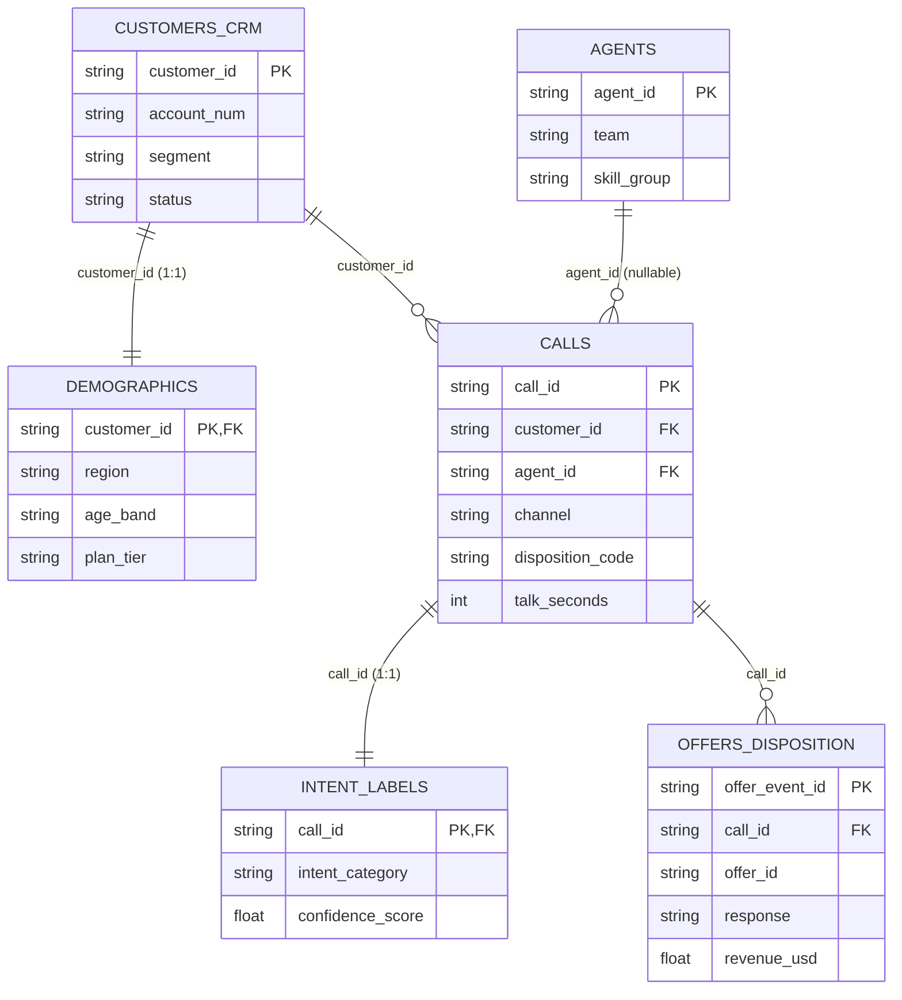
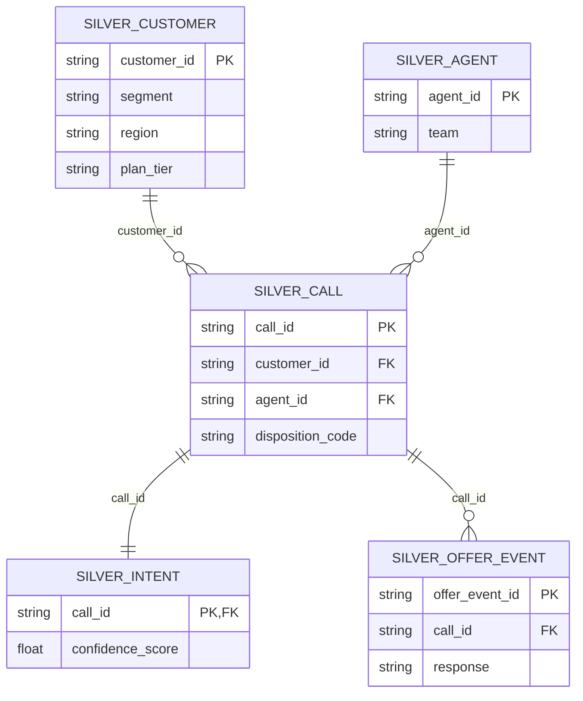
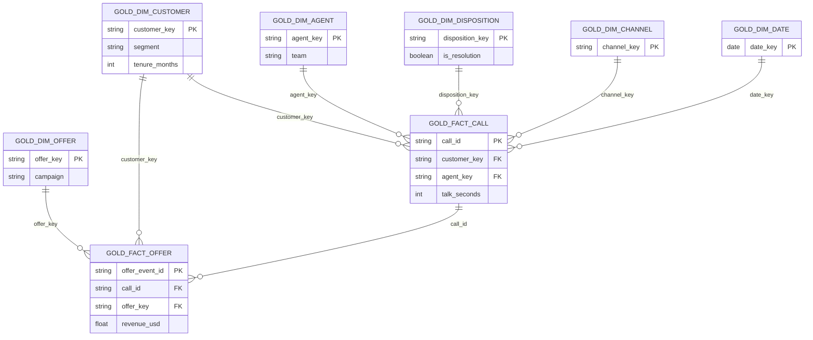
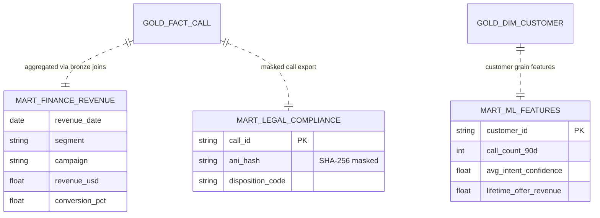
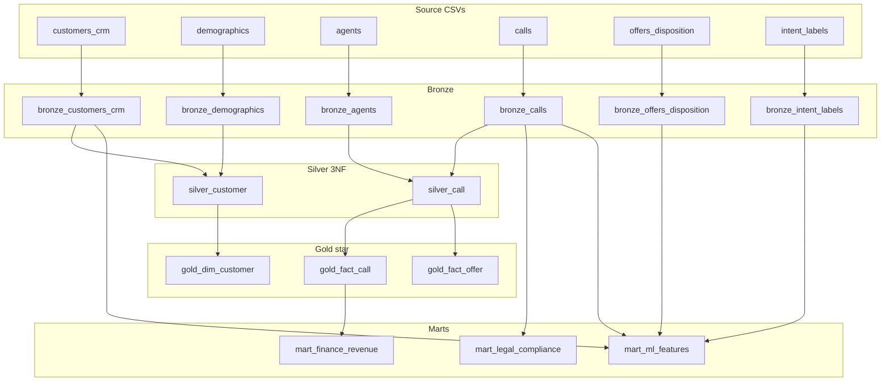

# Data Model & ERD — Telco CRM Lakehouse

Linked dataset relationships across **source samples → silver 3NF → gold star schema → consumer marts**.

Portfolio reference style: [uber-data-engineering-mage-project/data_model](https://github.com/darshilparmar/uber-data-engineering-mage-project/blob/main/data_model.jpeg) — this repo uses **Mermaid ERD** (version-controlled, GitHub-renderable).

| Diagram | Layer | File |
|---|---|---|
| Source sample ERD | Bronze inputs | [§1 Source ERD](#1-source-sample-erd) |
| Silver 3NF ERD | Normalized entities | [§2 Silver ERD](#2-silver-3nf-erd) |
| Gold star schema | Dimensions + facts | [§3 Gold star ERD](#3-gold-star-schema-erd) |
| Consumer marts | Finance / legal / ML | [§4 Mart ERD](#4-consumer-mart-erd) |
| End-to-end lineage | All layers | [§5 Medallion lineage](#5-medallion-lineage-map) |

Cross-reference: [data-dictionary.md](../../data-dictionary.md) · [DESIGN.md](../DESIGN.md) §6

---

## 1. Source sample ERD

Six synthetic CSV files under `data/source/samples/`. Foreign keys enforced at silver layer.

**Cardinality (certified sample):** 300 customers · 1,500 calls · 800 offers · 1,500 intents · 40 agents

---

## 2. Silver 3NF ERD

Normalized entities loaded from [medallion/silver/sql/](../../medallion/silver/sql/).

---

## 3. Gold star schema ERD

Star schema built from [medallion/gold/sql/](../../medallion/gold/sql/). Facts join dimensions on surrogate keys.

---

## 4. Consumer mart ERD

Domain-specific marts in [medallion/marts/sql/](../../medallion/marts/sql/).

---

## 5. Medallion lineage map

How datasets flow across layers (architecture companion to ERD).

---

## Related artifacts

| Artifact | Path |
|---|---|
| Column-level dictionary | [data-dictionary.md](../../data-dictionary.md) |
| ASK → SOLUTION → CODE proof | [DESIGN.md](../DESIGN.md) |
| KPI SQL | [analytics_query.sql](../../analytics_query.sql) |
| Interactive dashboard | [data/evidence/dashboard.html](../../data/evidence/dashboard.html) |
